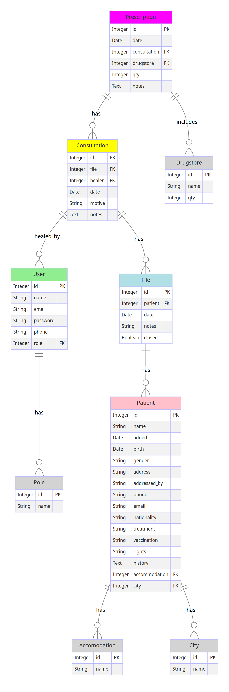

# medecins-benevoles

TODO : 
- ~~Rhésus <-> Nationalité~~
- ~~Notes -> Antécédents~~
- ~~retirer email de la recherche~~
- ~~rajouter Consultations dans le menu~~
- ~~inverser select date~~
- ~~bouton déconnecter~~
- pagination
- ~~Ajouter les colonnes ATCD et Vaccination dans la fiche Consultation~~
- ~~Ajouter Droits Sociaux dans la fiche Patient~~
- ~~Accès en lecture pour tout les rôles~~
- ~~Ajout Pharmacie~~

08/06/2024
fiche patient :
 - renommer coords administrative
 - ~~retirer Traitement en cours + Vaccination + ATCD~~
 - ~~historique accomodations (1 - n)~~
 - ~~droits sociaux (1 - n)~~

 Dossier :
 - ~~renommer Antécédants médicaux~~
 - ~~relation 1 - 1 avec patient~~
 - ~~ajouter Traitement en cours + Vaccination + ATCD~~

 Prescriptions :
 - ~~Renommer Prescriptions médicaments~~
 - ~~liste médicaments mbv à fournir~~
 - ~~ajouter le champ 'remis' ou 'non remis'~~
 - ~~aspect légal ordonnances~~
 - ~~bouton imprimer format A4 sur feuille pré-imprimée~~
 - ~~1 - n drugstore~~

~~ajouter table Orientation (n - 1 table Consultation)~~
 - ~~menu déroulant c.f. tableau Excel~~
 - ~~champ texte libre~~

~~droits ajout Dossier pour accueillant~~

25/07/2024
- ~~droits sociaux : Oui / Non / En cours~~
- ~~patients : champs Nom et Prénom~~
- ~~prescriptions : colonnes médicaments  ; posologie ; quantité ; remis ; note~~
- ~~pharmacie : liste ordre alphabétique~~
- refresh en cas de retour navigateur

07/09/2024
- ~~classer logement et droits sociaux DESC~~
- ~~droits sociaux "yes"~~
- ~~menu déroulant "genre"~~
- ~~bug quantité prescriptions~~
- ~~supprimer entrées pour date en cours~~
- ~~orientation -> notes en bloc de texte~~
- ~~orientation -> orientation1, orientation2, orientation3~~
- ajouter "Autre" dans la liste des médicaments
- ~~supprimer prix liste médicaments~~

05/10/2024
- table Assistance Sociale ?
- ~~renommer applications gestebenevole~~
- ~~corriger impression Orientation~~
- ~~envoyer par mail les identifiants~~
- ~~reformatter l'impression des prescriptions~~
- theme par environnement (dev, prod, pre-prod)
- ~~descendre en bas de page après formulaires~~

16/11/2024
- ~~ATCD + vaccination visible uniquement par médecins~~
- ~~Liste des consultations visibles pour les accueillants~~

11/01/2025
- ~~ajouter "domicile personnel" dans accommodation~~
- ~~ajouter "arrivée en France" dans fiche patient~~
- ~~requete patient par genre~~
- ~~requete patient par tranche d'âge (à reprende depuis AG)~~
- exclure patient 966 (test) des requêtes SQL
- ~~Notes accueil et Notes médecin~~

01/02/2025
- ~~impression ordonnance -> la date 13/01 s'affiche par défaut~~
- patient: inverser nom <-> prénom à partir de AHMED ABDOU HAMZA 
- ~~- patient : renommer colonnes nom et prénom~~
- ~~patient : trier par "viewed" desc~~
- prescription médicaments : remis "Oui" ou "Non"
- ~~profil Assistant.e sociale : vérifier RBAC~~
- ~~bug "Python date objects" sur champ "Date d'arrivée en France"~~

03/03/2025
- Ajouter location "Elancourt"
- Fournir détails box 5g à Marie-jo
- Ajouter requête SQL sur Orientation (nom, prénom, etc.)